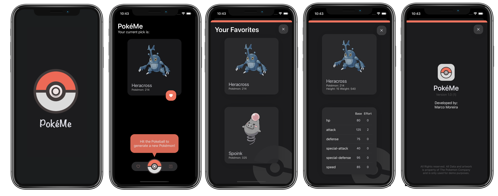

# PokéMe

## Intro
PokéMe is a small demo app that displays a random Pokémon that a user can add to his/her favorite list.

### App preview - Light Mode 

### App preview - Dark Mode 

This app was built using VIPER Architecture where the **V**iew displays what it is told to by the **P**resenter that communicates with the **I**nteractor that contains all the business logic.
The **P**resenter uses the **R**outer to navigate between modules. 
Each VIPER module contains a series of **E**ntities that have the function of storing the View Model and  Business Model. Besides these entities each module has a DTO (Data Transfer Object) that is designed to send data between each module.
To help to instantiate each VIPER module we have a helper module called Assembly.

## App Notes 
- This app was designed to be prepared for localization in every language possible. To translate the app into a new language we only need to add a new `Localizable.String` file with all the new strings.

- To help the user find the refresh button (pokeball icon in the main screen) the app contains a Tutorial Callout that will appear after 3.5 seconds after the app launches and will disappear after the user uses the refresh function for the first time.

- In case an endpoint changes this app was designed to have a centralized endpoint list avaliable in the `CommonDataLayerEndpointBuilderEnum`.

- This app contains some custom UI elements that can be used in other projects like the `InfoView` or the `menu`. Each UI element contains a specific view model that makes it independent and reusable in any app. To re-use it the developer only needs to instantiate the UI element and call the `setup` function. 

- Even in the best apps sometimes there are issues/errors, thats why this app has a `InfoView` element that displays to the user information about possible issues like: no internet connection, api is down or even when there are no favorites selected.

- This app uses a Common Data Layer (CDL) that is designed to be independent from each VIPER module. This approach makes it easier to test each Data module and makes it easier to share common data code between all VIPER modules.

- To ensure quality this app contains a test target that will execute automatic tests of the most crucial parts of the app.

- To develop this app I used two pods: `SDWebImage` and `NVActivityIndicatorView`. The use of these is free under the MIT licencing model.

- To make all users happy this app was designed to be 100% dark mode compatible.

- To ensure this app is used by a bigger audience all screens are compatible not only in portrait mode but also in ladscape mode for iOS and iPadOS.

- This app is currently not integrated with any Logging framework but all the steps were taken to make sure that the integration of a Loggin framework is as easy as possible. Instead of using the `print` funtion this app uses a String extension that can be replaced by the Logging framework. 

- The webhook.site url used in this solution is: https://webhook.site/514d236a-c238-46bb-9091-3f511f7329de
