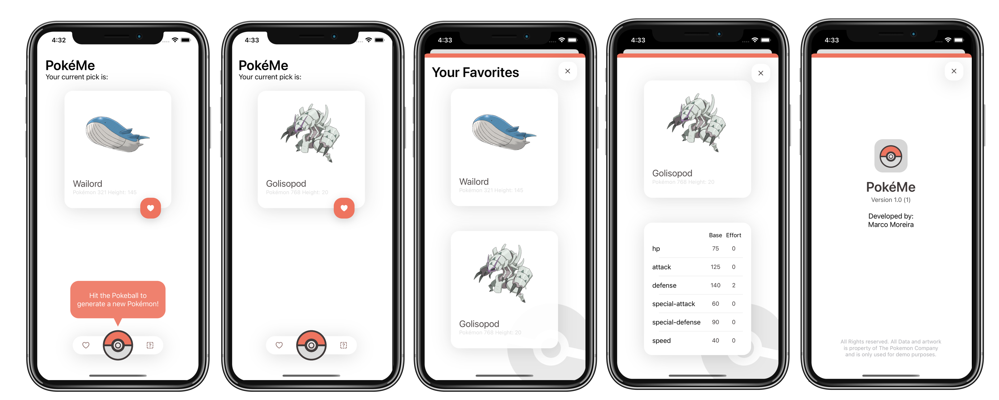

# PokéMe

## Intro
PokéMe is a small demo app that displays a random Pokémon that a user can add to its favorite list

This app was built using VIPER Architecture where the **V**iew displays what it is told to by the **P**resenter that communicates with the **I**nteractor that contains all the business logic.
The **P**resenter uses the **R**outer to navigate between modules. 
Each VIPER module contains a series of **E**ntities that have the function of storing the View Model and  Business Model. Besides these entities each module has a DTO (Data Transfer Object) that is designed to send data between each module.
To help to instantiate each VIPER module we have a helper module called Assembly.

## App Notes 
- This app was designed to be prepared for localization in every language possible. To translate the app into a new language we only need to add a new `Localizable.String` file with all the new strings.

- In case an endpoint changes this app was design to have a centralized endpoint list avaliable in the `CommonDataLayerEndpointBuilderEnum`.

- This app contains some custom UI elements that can be used in other projects like the `InfoView` or the `menu`. Each UI element contains a specific view model that makes it independent and reusable in any app. To re-use it the developer only needs to instantiate the UI element and call the `setup` function. 

- This app uses a Common Data Layer (CDL) that is designed to be independent from each VIPER module. This approach makes it easier to test each Data module and makes it easier to share common data code between all VIPER modules.

- To develop this app i used two pods: `SDWebImage` and `NVActivityIndicatorView` the use of them are free under the MIT licencing model.

